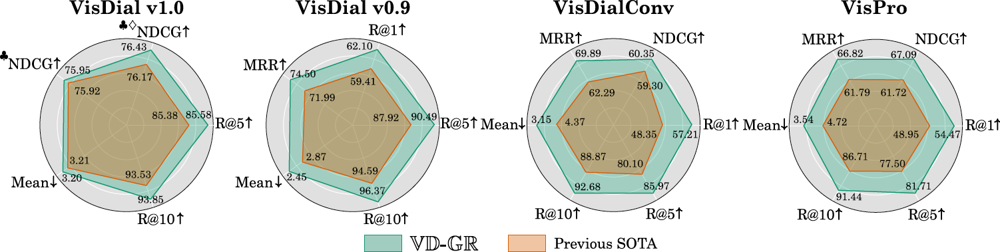

<div align="center">
<h1> VD-GR: Boosting Visual Dialog with Cascaded Spatial-Temporal Multi-Modal GRaphs </h1>
    
**[Adnen Abdessaied][5], &nbsp; [Lei Shi][6], &nbsp; [Andreas Bulling][7]** <br> <br>
**WACV'24, Hawaii, USA**  <br>
**[[Paper][8]]**

-------------------
<br><br>

</div>

# Table of Contents
* [Setup and Dependencies](#Setup-and-Dependencies)
* [Download Data](#Download-Data)
* [Pre-trained Checkpoints](#Pre-trained-Checkpoints)
* [Training](#Training)
* [Results](#Results)

# Setup and Dependencies
We implemented our model using Python 3.7 and PyTorch 1.11.0 (CUDA 11.3, CuDNN 8.2.0). We recommend to setup a virtual environment using Anaconda. <br>
1. Install [git lfs][1] on your system
2. Clone our repository to download the data, checkpoints, and code
   ```shell
   git lfs install
   git clone this_repo.git
   ```
3. Create a conda environment and install dependencies
   ```shell
   conda create -n vdgr python=3.7
   conda activate vdgr
   conda install pytorch==1.11.0 torchvision==0.12.0 torchaudio==0.11.0 cudatoolkit=11.3 -c pytorch
   conda install pyg -c pyg  # 2.1.0
   pip install pytorch-transformers
   pip install pytorch_pretrained_bert
   pip install pyhocon glog wandb lmdb
    ```
4. If you wish to speed-up training, we recommend installing [apex][2]
   ```shell
   git clone https://github.com/NVIDIA/apex
   cd apex
   # if pip >= 23.1 (ref: https://pip.pypa.io/en/stable/news/#v23-1) which supports multiple `--config-settings` with the same key... 
   pip install -v --disable-pip-version-check --no-cache-dir --no-build-isolation --config-settings "--build-option=--cpp_ext" --config-settings "--build-option=--cuda_ext" ./
   # otherwise
   pip install -v --disable-pip-version-check --no-cache-dir --no-build-isolation --global-option="--cpp_ext" --global-option="--cuda_ext" ./
   cd .. 
   ```

# Download Data
1. Download the extacted visual features of [VisDial][3] and setup all files we used in our work. We provide a shell script for convenience:
```shell
./setup_data.sh  # Please make sure you have enough disk space
```
If everything was correctly setup, the ```data/``` folder should look like this
```
├── history_adj_matrices
│   ├── test
│        ├── *.pkl
│   ├── train
│        ├── *.pkl
│   ├── val
│        ├── *.pkl
├── question_adj_matrices
│   ├── test
│        ├── *.pkl
│   ├── train
│        ├── *.pkl
│   ├── val
│        ├── *.pkl
├── img_adj_matrices
│   ├── *.pkl
├── parse_vocab.pkl
├── test_dense_mapping.json
├── tr_dense_mapping.json
├── val_dense_mapping.json
├── visdial_0.9_test.json
├── visdial_0.9_train.json
├── visdial_0.9_val.json
├── visdial_1.0_test.json
├── visdial_1.0_train_dense_annotations.json
├── visdial_1.0_train_dense.json
├── visdial_1.0_train.json
├── visdial_1.0_val_dense_annotations.json
├── visdial_1.0_val.json
├── visdialconv_dense_annotations.json
├── visdialconv.json
├── vispro_dense_annotations.json
└── vispro.json
```
# Pre-trained Checkpoints
For convenience, we provide checkpoints of our model after the warm-up training stage in ```ckpt/``` for both VisDial v1.0 and VisDial v0.9. <br>
These checkpoints will be downloaded with the code if you use ```git lfs```.

# Training
We trained our model on 8 Nvidia Tesla V100-32GB GPUs. The default hyperparameters in ```config/vdgr.conf``` and ```config/bert_base_6layer_6conect.json```  need to be adjusted if your setup differs from ours.

## Phase 1
### Training
1. In this phase, we train our model on VisDial v1.0 via
```shell
CUDA_VISIBLE_DEVICES=0,1,2,3,4,5,6,7 python main.py \
--model vdgr/P1 \
--mode train \
--tag K2_v1.0 \
--wandb_mode online \
--wandb_project your_wandb_project_name
```
⚠️ On a similar setup to ours, this will take roughly 20h to complete using apex for training.

2. To train on VisDial v0.9:
   * Set ```visdial_version = 0.9``` in ```config/vdgr.conf```
   * Set ```start_path = ckpt/vdgr_visdial_v0.9_after_warmup_K2.ckpt``` in ```config/vdgr.conf```
   * Run
    ```shell
     CUDA_VISIBLE_DEVICES=0,1,2,3,4,5,6,7 python main.py \
     --model vdgr/P1 \
     --mode train \
     --tag K2_v0.9 \
     --wandb_mode online \
     --wandb_project your_wandb_project_name
    ```
### Inference
1. For inference on  VisDial v1.0 val, VisDialConv, or VisPro:
    * Set ```eval_dataset = {visdial, visdial_conv, visdial_vispro}``` in ```logs/vdgr/P1_K2_v1.0/code/config/vdgr.conf```
    * Run
    ```shell
     CUDA_VISIBLE_DEVICES=0,1,2,3,4,5,6,7 python main.py \
     --model vdgr/P1 \
     --mode eval \
     --eval_dir logs/vdgr/P1_K2_v1.0 \
     --wandb_mode offline \
    ```
2. For inference on VisDial v0.9:
    * Set ```eval_dataset = visdial``` in ```logs/vdgr/P1_K2_v0.9/code/config/vdgr.conf```
    * Run
    ```shell
     CUDA_VISIBLE_DEVICES=0,1,2,3,4,5,6,7 python main.py \
     --model vdgr/P1 \
     --mode eval \
     --eval_dir logs/vdgr/P1_K2_v0.9 \
     --wandb_mode offline \
    ```
⚠️ This might take some time to finish as the testing data of VisDial v0.9 is large.

3. For inference on the ```visdial_v1.0 test```:
   * Run
    ```shell
     CUDA_VISIBLE_DEVICES=0,1,2,3,4,5,6,7 python main.py \
     --model vdgr/P1 \
     --mode predict \
     --eval_dir logs/vdgr/P1_K2_v1.0 \
     --wandb_mode offline \
    ```
    * The output file will be saved in ```output/```

## Phase 2
In this phase, we finetune on dense annotations to improve the NDCG score (Only supported for VisDial v1.0.)
1. Run
```shell
CUDA_VISIBLE_DEVICES=0,1,2,3,4,5,6,7 python main.py \
--model vdgr/P2_CE \
--mode train \
--tag K2_v1.0_CE \
--wandb_mode online \
--wandb_project your_wandb_project_name
```
⚠️This will take roughly 3-4 hours to complete using the same setup as before and [DP][4] for training.

2. For inference on VisDial v1.0:
   * Run:
    ```shell
    CUDA_VISIBLE_DEVICES=0,1,2,3,4,5,6,7 python main.py \
    --model vdgr/P2_CE \
    --mode predict \
    --eval_dir logs/vdgr/P1_K2_v1.0_CE \
    --wandb_mode offline \
    ```
   * The output file will be saved in ```output/```

## Phase 3
### Training
In the final phase, we train an ensemble method comprising of 8 models using ```K={1,2,3,4}``` and ```dense_loss={ce, listnet}```.
For ```K=k```:
1. Set the value of ```num_v_gnn_layers, num_q_gnn_layers, num_h_gnn_layers``` to ```k```
2. Set ```start_path = ckpt/vdgr_visdial_v1.0_after_warmup_K[k].ckpt``` in ```config/vdgr.conf``` (P1)
3. Phase 1 training:
```shell
CUDA_VISIBLE_DEVICES=0,1,2,3,4,5,6,7 python main.py \
--model vdgr/P1 \
--mode train \
--tag K[k]_v1.0 \
--wandb_mode online \
--wandb_project your_wandb_project_name
```
3. Set ```start_path = logs/vdgr/P1_K[k]_v1.0/epoch_best.ckpt``` in ```config/vdgr.conf``` (P2)
4. Phase 2 training:
* Fine-tune with CE:
 ```shell
 CUDA_VISIBLE_DEVICES=0,1,2,3,4,5,6,7 python main.py \
 --model vdgr/P2_CE \
 --mode train \
 --tag K[k]_v1.0_CE \
 --wandb_mode online \
 --wandb_project your_wandb_project_name
```
* Fine-tune with LISTNET:
 ```shell
 CUDA_VISIBLE_DEVICES=0,1,2,3,4,5,6,7 python main.py \
 --model vdgr/P2_LISTNET \
 --mode train \
 --tag K[k]_v1.0_LISTNET \
 --wandb_mode online \
 --wandb_project your_wandb_project_name
```
### Inference
1. For inference on VisDial v1.0 test:
```shell
CUDA_VISIBLE_DEVICES=0,1,2,3,4,5,6,7 python main.py \
--model vdgr/P2_[CE,LISTNET] \
--mode predict \
--eval_dir logs/vdgr/P2_K[1,2,3,4]_v1.0_[CE,LISTNET] \
--wandb_mode offline \
```
2. Finally, merge the outputs of all models
```shell
 python ensemble.py \
--exp test \
--mode predict \
```
The output file will be saved in ```output/```

# Results
## VisDial v0.9
| Model    | MRR | R@1 | R@5 | R@10 | Mean |
|:--------:|:---:|:---:|:---:|:----:|:----:|
| Prev. SOTA | 71.99 | 59.41 | 87.92 | 94.59 | 2.87 | 
| VD-GR | **74.50** | **62.10** | **90.49** | **96.37** | **2.45** | 

## VisDialConv
| Model    | NDCG | MRR | R@1 | R@5 | R@10 | Mean |
|:--------:|:----:|:---:|:---:|:---:|:----:|:----:|
| Prev. SOTA | 61.72 | 61.79 | 48.95 | 77.50 | 86.71 | 4.72 | 
| VD-GR | **67.09** | **66.82** | **54.47** | **81.71** | **91.44** | **3.54** | 

## VisPro
| Model    | NDCG | MRR | R@1 | R@5 | R@10 | Mean |
|:--------:|:----:|:---:|:---:|:---:|:----:|:----:|
| Prev. SOTA | 59.30 | 62.29 | 48.35 | 80.10 | 88.87 | 4.37 | 
| VD-GR | **60.35** | **69.89** | **57.21** | **85.97** | **92.68** | **3.15** |

## VisDial V1.0 Val
| Model    | NDCG | MRR | R@1 | R@5 | R@10 | Mean |
|:--------:|:----:|:---:|:---:|:---:|:----:|:----:|
| Prev. SOTA | 65.47 | 69.71 | 56.79 | 85.82 | 93.64 | 3.15 | 
| VD-GR | 64.32 | **69.91** | **57.01** | **86.14** | **93.74** | **3.13** | 

## VisDial V1.0 Test
| Model    | NDCG | MRR | R@1 | R@5 | R@10 | Mean |
|:--------:|:----:|:---:|:---:|:---:|:----:|:----:|
| Prev. SOTA | 64.91 | 68.73 | 55.73 | 85.38 | 93.53 | 3.21 | 
| VD-GR | 63.49 | 68.65 | 55.33 | **85.58** | **93.85** | **3.20** | 
| ♣️ Prev. SOTA | 75.92 | 56.18 | 45.32 | 68.05 | 80.98 | 5.42 | 
| ♣️ VD-GR | **75.95** | **58.30** | **46.55** | **71.45** | 84.52 | **5.32** | 
| ♣️♦️ Prev. SOTA  | 76.17 | 56.42 | 44.75 | 70.23 | 84.52 | 5.47 | 
| ♣️♦️ VD-GR | **76.43** | 56.35 | **45.18** | 68.13 | 82.18 | 5.79 | 

♣️ = Finetuning on dense annotations, ♦️ = Ensemble model


[1]: https://git-lfs.com/
[2]: https://github.com/NVIDIA/apex
[3]: https://visualdialog.org/
[4]: https://pytorch.org/tutorials/beginner/blitz/data_parallel_tutorial.html
[5]: https://adnenabdessaied.de
[6]: https://www.perceptualui.org/people/shi/
[7]: https://www.perceptualui.org/people/bulling/
[8]: https://drive.google.com/file/d/1GT0WDinA_z5FdwVc_bWtyB-cwQkGIf7C/view?usp=sharing
